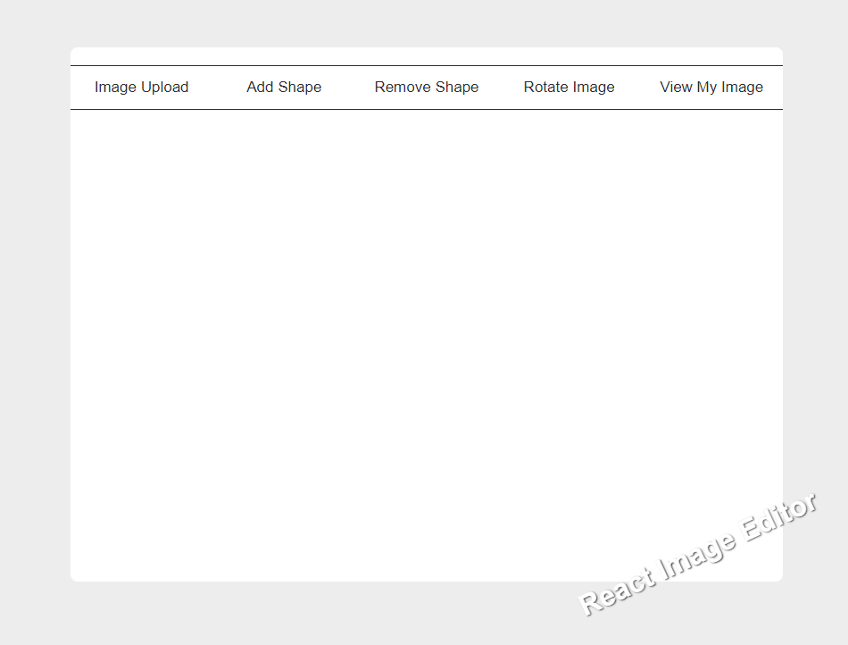

# react-image-editor

[ demo ] : <https://mj-seok.com/react-image-editor/>

## 외부 이미지 에디터를 쓰다가, 덜 종속된 환경을 제작해보고 싶었습니다.

- HTML5 캔버스부터 시작할까 생각했지만, fabric.js 라이브러리가 캔버스와 도형, 이미지로 할 수 있는 작업을
  기능별로 제공하고 있는 것을 발견하였습니다.
- 따라서 React에 fabric을 불러와서 Typescript로 제작하게 되었습니다.
- 최근 자바스크립트에서 타입스크립트로 확장되며 인기가 상승하는 움직임에 같이 공부하며 즐겁게 만들어보았습니다.

> React.js, Typescript, fabric 라이브러리

## 미리보기 Preview

